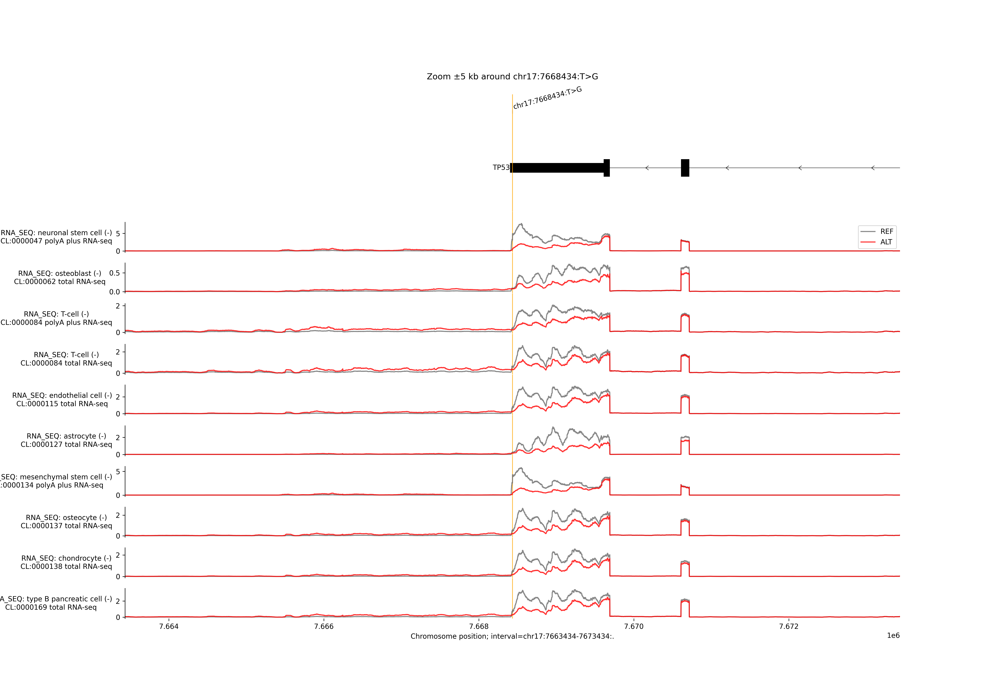

# MVP AlphaGenome Variant Scoring Pipeline

This repository contains a comprehensive pipeline for scoring genetic variants from the MVP (Million Veteran Program) study using [AlphaGenome](https://github.com/google-deepmind/alphagenome/tree/main). The pipeline includes variant scoring, track aggregation, ranking, and visualization capabilities.

## Overview

The pipeline processes MVP variants with high posterior inclusion probability (PIP > 0.95) and uses AlphaGenome to predict their effects on various genomic tracks like RNA-seq, CAGE, ATAC-seq, and ChIP-seq. The results are aggregated and ranked based on quantile scores to identify the most impactful variants.

## Pipeline Components

### 1. Variant Scoring (`variant_scoring.batch.threadPoolExec.py`)

**Purpose**: Scores MVP variants using AlphaGenome's variant scorers in parallel.

**Key Features**:
- Processes variants with PIP > 0.95 from the MVP study
- Uses multiple genomic tracks for comprehensive scoring
- Parallel execution with configurable thread count
- Supports different sequence lengths (2KB, 16KB, 100KB, 500KB, 1MB)

**Configuration**:
```python
INPUT_FILE = "Data_S1.xlsx"  # MVP study file
PIP_THRESHOLD = 0.95         # Filter variants by PIP
MAX_WORKERS = 25             # Parallel threads
SEQUENCE_SIZE = '1MB'        # Sequence length for scoring
```

**Supported Tracks**:
- RNA-seq (polyA+ and total)
- CAGE (Cap Analysis Gene Expression)
- PRO-cap
- ATAC-seq (Assay for Transposase-Accessible Chromatin)
- DNase-seq
- ChIP-seq (histone marks and transcription factors)
- Polyadenylation
- Splice sites and junctions

**Output**: Individual CSV files for each variant containing scores across all tracks.

### 2. Track Aggregation (`aggregate_tracks.py`)

**Purpose**: Aggregates track scores across variants and identifies extreme effects.

**Key Metrics**:
- **Extreme tracks**: Quantile score > 0.95 or < -0.95
- **Upregulated tracks**: Quantile score > 0.95
- **Downregulated tracks**: Quantile score < -0.95

**Features**:
- Parallel processing of all variant score files
- Summary statistics for each variant
- Ranking by number of extreme tracks

**Output**: `variant_quantile_summary_parallel.csv` with aggregated statistics.

### 3. Variant Visualization (`visualize_variants.py`)

**Purpose**: Creates genomic visualizations of variant effects on top-scoring tracks.

**Features**:
- Reads variant score CSV files
- Identifies tracks with highest absolute quantile scores
- Generates genomic plots showing:
  - Transcript annotations
  - RNA-seq tracks
  - CAGE tracks
  - ATAC-seq tracks
  - ChIP-seq tracks
- Interactive visualization with gene annotations

**Output**: plots showing genomic context and ALT/REF tracks.

### Sample visualization



## Data Sources

### MVP Study Data
- **Source**: [Data Dryad Repository](https://datadryad.org/dataset/doi:10.5061/dryad.zgmsbcck4)
- **File**: `Data_S1.xlsx`
- **Content**: Fine-mapped variants with PIP scores, population information, and genomic coordinates

### AlphaGenome Model
- **API Key**: Required for accessing AlphaGenome predictions
- **Organism**: Homo sapiens (GRCh38)
- **Supported Outputs**: Multiple genomic tracks and assays

## File Structure

```
├── Data_S1.xlsx                           # MVP study data
├── filtered_variants.xlsx                 # Variants with PIP > 0.95
├── predictions/                           # Individual variant score files
│   ├── chr_*_*_*_*_scores.csv            # Variant-specific scores
│   └── ...
├── variant_quantile_summary_parallel.csv  # Aggregated track statistics
├── plot_top_quantile_scores.png          # Visualization output
├── variant_scoring.batch.threadPoolExec.py # Main scoring script
├── aggregate_tracks.py                    # Track aggregation script
├── visualize_variants.py                  # Visualization script
└── README.md                             # This file
```

## Usage

### 1. Setup Environment

```bash
# Install required packages
pip install pandas numpy matplotlib tqdm openpyxl

# Set up AlphaGenome API key
export ALPHAGENOME_API_KEY="your_api_key_here"
```

### 2. Run Variant Scoring

```bash
python variant_scoring.batch.threadPoolExec.py
```

This will:
- Load MVP variants with PIP > 0.95
- Score each variant across multiple genomic tracks
- Save individual CSV files in the `predictions/` directory

### 3. Aggregate Track Scores

```bash
python aggregate_tracks.py
```

This will:
- Process all variant score files in parallel
- Calculate extreme track statistics
- Generate summary CSV with rankings

### 4. Visualize Top Variants

```bash
python visualize_variants.py
```

This will:
- Load a specific variant's scores
- Identify top-scoring tracks
- Generate genomic visualization plots

## Output Interpretation

### Quantile Scores
- **Range**: -1 to +1
- **Interpretation**: 
  - Positive values: Variant increases track activity
  - Negative values: Variant decreases track activity
  - Extreme values (>0.95 or <-0.95): Strong effects

### Track Types
- **RNA-seq**: Gene expression changes
- **CAGE**: Transcription start site activity
- **ATAC-seq**: Chromatin accessibility
- **ChIP-seq**: Transcription factor binding and histone modifications

### Visualization Features
- **Transcript annotations**: Shows genes in the region
- **Track plots**: Shows predicted activity levels
- **Strand information**: Indicates direction of transcription
- **Biosample information**: Shows cell/tissue type

## Configuration Options

### Scoring Parameters
- `PIP_THRESHOLD`: Minimum PIP for variant inclusion (default: 0.95)
- `MAX_WORKERS`: Number of parallel threads (default: 25)
- `SEQUENCE_SIZE`: Genomic context size (default: 1MB)
- `DOWNLOAD_PREDICTIONS`: Save individual predictions (default: True)

### Track Selection
The pipeline can be configured to use specific track types by modifying the `scorer_selections` dictionary in the scoring script.

<!-- ## Dependencies

- **Python** 3.11
- **pandas**
- **numpy**
- **matplotlib**
- **tqdm**
- **openpyxl**
- **alphagenome** (requires API access) -->

<!-- ## Citation

If you use this pipeline, please cite:
- The MVP study: [MVP Citation]
- AlphaGenome: [AlphaGenome Citation]

## License

[Add your license information here]

## Contact

For questions or issues, please contact [your contact information]. -->
